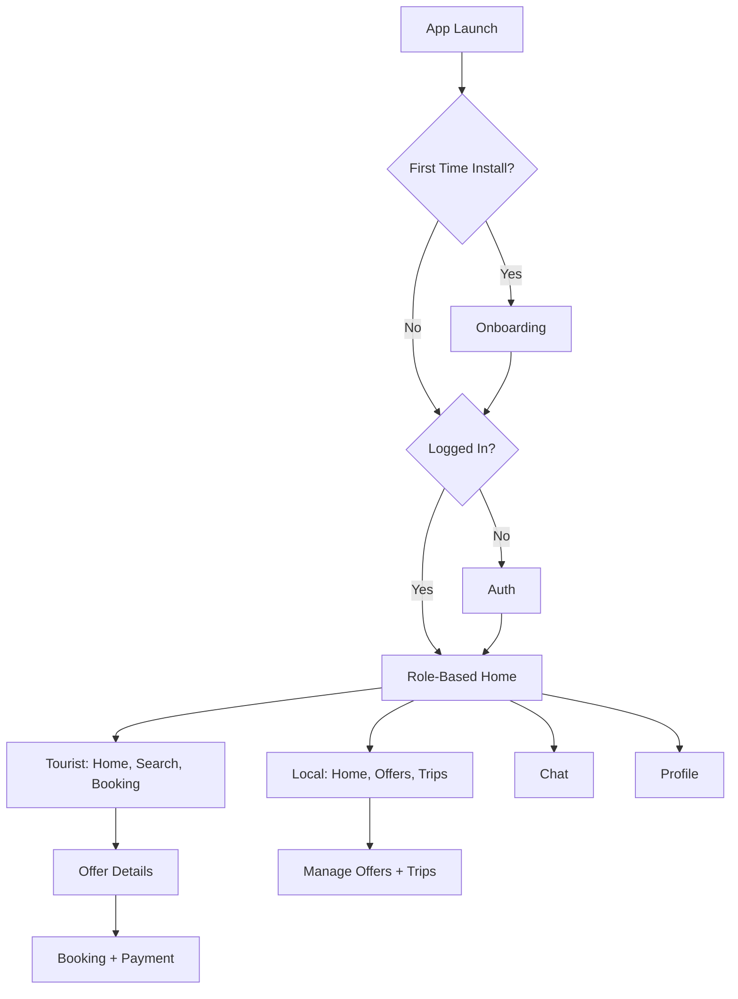

# Kobeur

Kobeur is a Flutter app that connects tourists with locals, enabling travelers to discover local offers, book experiences, and chat in real time while locals manage offers and trips. The app uses GetX for state management and dependency injection, a feature-first structure, and a service/repository layer to keep UI, business logic, and data access cleanly separated.

## Overview

- App name: Kobeur
- Platforms: Android, iOS, Web, macOS, Windows, Linux
- SDK: Flutter with Dart `^3.7.2`
- Version: `2.0.5`
- Architecture: Feature-first + GetX controllers + repositories + services

## Introduction

Kobeur is built around a two-sided experience:

Tourist:
- Discover local offers and experiences
- Search, view details, and book
- Pay securely and manage bookings
- Chat with locals and view trip history

Local:
- Create and manage offers
- Receive and manage bookings
- Chat with tourists
- Track trip status and profile details

## Key Features

- Role-based onboarding and authentication (tourist or local)
- Search and discovery for offers
- Offer details, favorites, and ratings
- Booking flow with confirmation and status tracking
- Payments with Stripe
- Real-time chat via Socket.IO
- Profile management and account settings
- Local storage for tokens and user preferences
- Deep linking support
- Media handling (images and files)

## App Flow (Simplified)



## Architecture

- State and dependency management: GetX
- Navigation: `GetMaterialApp` and custom bottom navigation
- Networking: `http` + custom `ApiClient`
- Real-time: `socket_io_client`
- Storage: `shared_preferences` and `get_storage`
- Payments: `flutter_stripe`

## Project Structure

```
lib/
  main.dart                        # App entry point
  core/                            # Themes, widgets, constants, services
  feature/                         # Feature modules
    auth/                          # Login, signup, OTP, role selection
    home/                          # Local and tourist home flows
    booking_module/                # Booking and confirmation screens
    trip_module/                   # Trip/booking lists and widgets
    offer/                         # Offer listing and details
    chat/                          # Messaging and chat history
    payment/                       # Stripe payment flows
    profile/                       # Profile and account settings
  helpers/                         # Dependency injection, API client
  navigation/                      # Bottom navigation
  utils/                           # Helpers and shared utilities
assets/
  images/                          # App images
  icons/                           # App icons
```

## Configuration

- API base URL and Socket URL: `lib/core/constants/urls.dart`
- Stripe publishable key: `lib/core/constants/app_constants.dart`
- Google Sign-In client IDs: `lib/core/constants/app_constants.dart`
- App icons: `pubspec.yaml` under `flutter_launcher_icons`

## Getting Started

1. Install dependencies:
   ```bash
   flutter pub get
   ```

2. Configure backend URLs:
   - Update `baseUrl` and `socketBaseUrl` in `lib/core/constants/urls.dart`.

3. Configure Stripe and Google Sign-In:
   - Update `publishableKey`, `clientId`, and `serverClientId` in `lib/core/constants/app_constants.dart`.
   - Make sure platform-specific configs match your keys.

4. Run the app:
   ```bash
   flutter run
   ```

## Common Commands

- Run tests:
  ```bash
  flutter test
  ```

- Regenerate launcher icons:
  ```bash
  flutter pub run flutter_launcher_icons
  ```

## Development Notes

- Dependency injection setup: `lib/helpers/dependency_injection.dart`
- API client and request handling: `lib/helpers/remote/data/api_client.dart`
- Role-based navigation: `lib/navigation/bottom_navigationber_screen.dart`

## Security and Secrets

Do not commit real API keys or production credentials. Move sensitive values to environment-specific builds or secure secret management.
